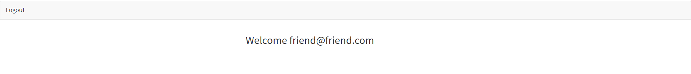

# Unit 14 Sequelize Homework: Reverse Engineering Code

Reverse engineer the starter code provided and create a tutorial for the code.

In the `Develop` folder, there is starter code for a project. Begin inspecting the code to get an understanding of each file's responsibility. Then, README markdown file, write a tutorial explaining *every* file and its purpose in as fine as detail as possible. If one file is dependant on other files, be sure to let the user know.

## Table of Contents
* [Technologies Used](#Technologies_Used)
* [Getting Started](#Getting_Started)
* [Tutorial](#Tutorial)
* [Usage](#Usage)
* [Author](#Author)
* [Credits](#Credits)
* [License](#License)

## Technologies_Used
* JavaScript 
* HTML
* CSS
* express.js
* express-sessions
* [node.js](https://www.npmjs.com/)
* [mysql](https://www.mysqltutorial.org/)
* passport.js
* sequelize
* bcrypt.js 

## Getting Started

1. To begin, clone the repository by selecting clone and copying the https file. Open your terminal on your computer to the file you want and type in git clone, then right click to display your copied text. 
2. Open your mysql workbench and open a new SQL tab for executing queries. In your type in 
Create database passport_demo;
Use passport_demo;

3. Run your query and then save it under the name passport_demo

4. In your code editor (with the files open) -right click on server.js and select "Open in Integrated Terminal" 

5. In your terminal, type a series of commands in order-followed by the enter key
* npm install
* npm init -y
* npm install express mysql2 express-session sequelize nodemon
* npm init -y
* nodemon server.js

6. Go to the config folder and open config.json, in the top section where it says password and username, enter your password and username. Be sure to use quotation marks, type it after the colon and remove any text that was there previously (such as NULL or another password). But leave all other indices alone. 
7. open browser and put in http://localhost:8000/

## Tutorial

This section describes each file's intended purpose and what it's dependencies are. 

## Config

### Middleware

Can be easily required/called anywhere

#### isAuthenticated.js

__Purpose__

This file restricts routes tht user is not allowed to visit if they are not logged in -i.e. the logged in page.

__Dependencies?__

### config.json

__Purpose__

Connection configuration to connect to the server and the mysql database.

__Dependencies?__

Not necessarily a dependency but it needs the database name, username and password to be able to connect.

### passport.js

__Purpose__

Contains a javascript logic that tells passport that we want to log in with specifically an email address and a password. If something isn't entered, it will ask for it again. 

__Dependencies?__

passport.js is dependant on passport, passport-local and models to work. 

## Models

This is the part of the code connects to both the controllers and the database

### index.js

__Purpose__

Connects to the database and imports the users log in data

__Dependencies?__

Config.json as this uses the database and needs config.json to connect. This piece also uses sequelize so it's dependant on the user typing in "npm install mysql2"

### user.js

__Purpose__

This file has the duel purpose of securing the database, if compromised and defining what is stored in the database by describing the variables.

__Dependencies?__

For security, bcrypt is needed (not an npm install).

## Public

This is the file for the "public" -the front end of the fullstack

### js

This file holds the javascript part of the front end of the project

### login.js

__Purpose__

Takes the input from the users log in, when they hit submit and then takes them to the member page if they were successful.

__Dependencies?__

members.js and members.html- because when you successfully log in, you replace the window location with members, so you don't only need the view (html) you also need the ability to manipulate the age

### member.js

__Purpose__

Does a GET request to see which is logged in and updates the current member name/email 

__Dependencies?__

This file is dependant on the api routes to do it's work

### signup.js

__Purpose__

Gets users input data and saves it into user data and then logs in the user into the member area.

__Dependencies?__

Uses api routes, the members html (and js), and passport js.

### stylesheets

This folder is meant to hold the CSS that will alter the styling of the page

### login.html

__Purpose__

This is the html log in page. It contains the forms, buttons and links to get from page to page and trigger the activities the user wants to make.

__Dependencies?__

login.html is dependant on login.js

### members.html

__Purpose__

members.html welcomes members by their email address, it also gives them the option to log out.

__Dependencies?__

Mostly just members.js but also will take you to the log in page (once you log out).

### signup.html

__Purpose__

The html that contains the sign up form. Also, allows you to navigate to the log in page

__Dependencies?__

Dependant on sign.up.js but also the api routes.

## Routes

This file contains all the routes part of our code, which interacts with the controller to help display the view. 

### api-routes.js

__Purpose__

Contains routes for logging in and out and getting the user specific data to be displayed client side. 

__Dependencies?__

This file is both dependent on the models file (communicating with the database) and the config/passport file. 

### html-routes.js

__Purpose__

Checks whether or not the user is signed in and whether the user has an account. Then, based on the checks it sends them to the correct html page.

__Dependencies?__

In order to check if the user has an account it needs to use the isAuthenticated.js file and in order to send the user to a different site (based off of authenticated or not); it needs login.html, members.html and signup.html.

## package.json

__Purpose__

Contains all the package info (all the npm installs along with the basics). It also contains version info.

__Dependencies?__

Mostly just the user (or installation person) and all the npm installs -although much of the code is dependant on these installs

## server.js 

__Purpose__

server.js requires all the packages, creates express and the middleware, creates routs, syncs databases/logs, sets up the PORT and logs messages in the terminal if successfully connected to server.

__Dependencies?__

* express
* express-sessions
* config/passport
* models (folder)
* public (folder)
* html-routes.js
* api-routes.js
* PORT

## Usage
### This is a basic tutorial of the code for me (or another developer) to use to help them understand the code

## Author 
Rachael Kelm-Southworth

* [linkedin](https://www.linkedin.com/in/rachael-kelm-southworth-87a3831b3) 

* [github](https://github.com/RKSouth/)

* [portfolio](https://rksouth.github.io/responsive_portfolio/)

 ## Credits

I would like to thank Kerwin, Manuel, Roger, Jerome and all my classmates for helping me understand this subject matter and anyone that contributed to make the base code.

## License
[MIT](https://choosealicense.com/licenses/mit/)
